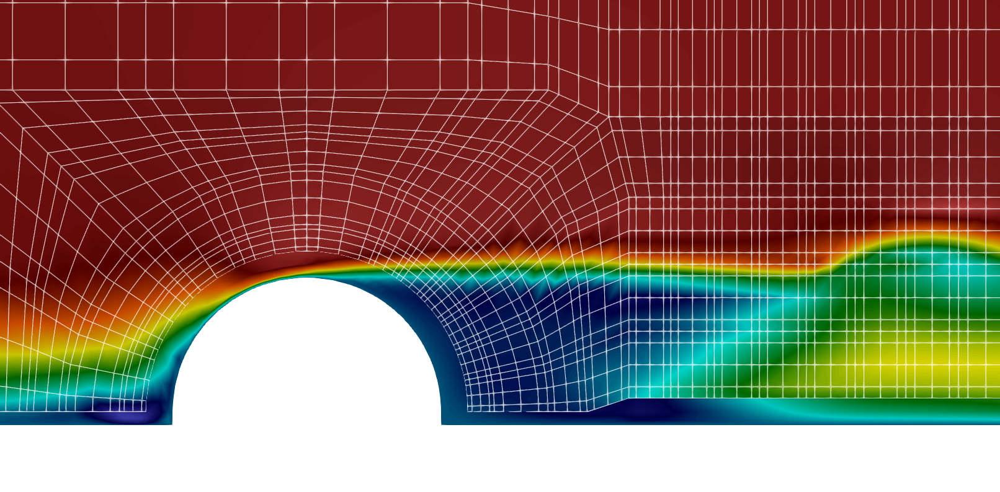
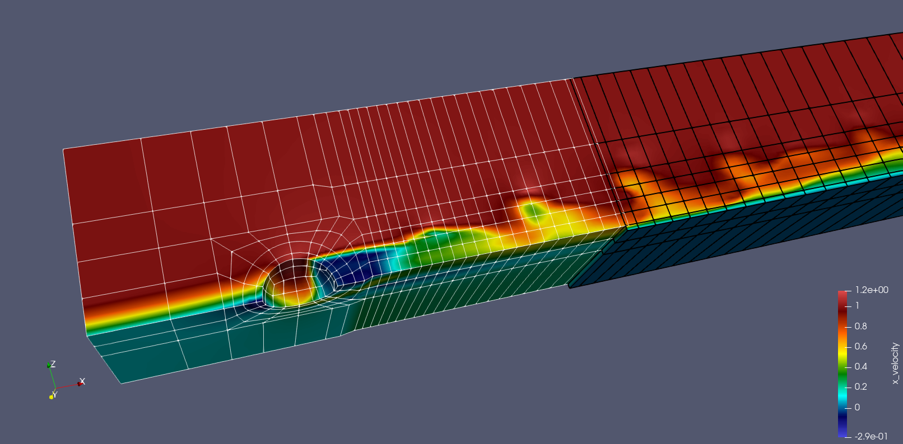

# delete selected elements

User tags come elements, we delete them and dump a new re2 (and co2) file.

## Usage: 
- Include `delete_el.f` in the user file.    

- Follow the "STEP" in usr file
  
  - STEP 1: map cbc into boundaryID    
    The code assign new boundaryID for user, then user has to setup CBC manually    
    For the BC    

  - STEP 2: select element to be removed        

  - STEP 3: set default bID for new bdry faces     
    When some elements are deleted, new boundary faces show up.    
    To assign new BC, we support:
    ```
       if new_bID<0, assign boundaryID = abs(new_bID) for all new boundary faces
       if new bID>0, Try to fill boundaryID from the opposite face of the deleted element.
                     If fail, it will assign the rest with new_bID      
    ```
    Old boundary faces will inherit the original BC      

  - STEP 4: recover CBC via boundaryID     
    User can find the BC via new_bID and re-assign to whatever suitable    

  - STEP 5: dump mesh into restart file and re2           
    Here we copy boundaryID to bc(5,f,e,1) in del_boundaryID_to_bc5     
    Therefore, the boundaryID of new faces will be recorded into re2 file  
    This is optional since some people (like me) can use that slot to do different stuff     

    You might want to use different imid in case some curved information is lost.      

- Once it's finished, it will generate the newre2.re2 and also dump field file    

- Notes:
  - run in parallel (only tested with small case)     
  - not supports DPROMAP
  - no support deleting the element having periodic       
  - requires lx1>2
  - Also copy solutions (vx,vy,vz,pr,t) to the new mesh     
  - The global elements is re-assigned but a restart file is dumped.       
    No need to use gfldr.


## TODOs:
- generate co2 file as well (require a special version of parRSB to do parallel sort)    
- Support periodic BC      
- support cht cases and t mesh
- trace boundary ID upto `lyr_max` layers 
- We could do this on-the-fly and keep the simulation running.   


## Examples
- `hemi/`      
   delete elements attached to the Wall BC.     

   Then, you can do the following to test the new mesh      

   ```
   mv newre2fin.re2 hemi_new.re2
   do gencon or genmap
   ./makenek testr
   ./nekbmpi hemi_new2  
   ```

   grep BC logfile
   ```
   my_plot_vcbc: CBC color table      # color table for cbc<case>0.f00001
   my_plot_vcbc: CBC: E  /   /P   /p   = 0
   my_plot_vcbc: CBC: v  /V            = 1
   my_plot_vcbc: CBC: o  /O            = 2
   my_plot_vcbc: CBC: W                = 3
   my_plot_vcbc: CBC: SYM              = 4
   my_plot_vcbc: CBC: else             =-1
   ```

   Note that, since it's only single layer, 
   the new faces automatically pickes up the wall BC 


   You can also try the commented section to delete elements crossing y=0 plane   
   That one is probably not runnable with Nek5000.    
   However, it will help you understand how bID_new works.      

   figs: Left part of the domain (with white elements outline) are the mesh after removing the skin layer on the Wall.   
   |||
   |:---:|:---:|
